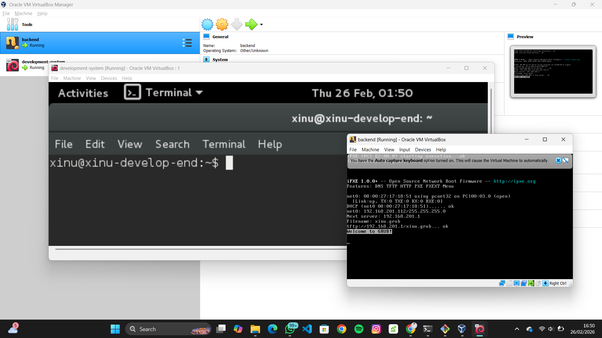

# <h1 align="center">Laporan Praktikum Modul 1   Pengenalan Praktikum & Setup Tools Sistem Operasi</h1>

Ardhian Dwi Saputra - 2311104040

---

## Dasar Teori

Pada modul ini dijelaskan mengenai sistem pelaksanaan praktikum, aturan yang berlaku, mekanisme penilaian, serta sanksi terhadap pelanggaran selama kegiatan berlangsung. Pemahaman terhadap aturan praktikum sangat penting agar kegiatan berjalan tertib, efektif, dan sesuai dengan tujuan pembelajaran.

Praktikum Sistem Operasi bertujuan untuk memberikan pengalaman langsung dalam memahami konsep dasar sistem operasi melalui simulasi menggunakan tools virtualisasi dan sistem operasi pembelajaran.

Tools yang digunakan dalam praktikum ini antara lain:

- Oracle VM VirtualBox  
  Software virtualisasi yang digunakan untuk menjalankan sistem operasi lain di dalam satu komputer (host). Pada praktikum ini digunakan untuk menjalankan Ubuntu dan Xinu.

- Xinu OS  
  Sistem operasi sederhana untuk tujuan edukasi, digunakan untuk memahami konsep kernel, manajemen proses, dan memori.

- Ubuntu  
  Sistem operasi berbasis Linux yang dijalankan sebagai guest OS pada VirtualBox.

- Sourcetrail  
  Tools untuk menganalisis dan memvisualisasikan struktur source code agar lebih mudah dipahami.

Dengan memastikan seluruh tools telah terinstall dan dapat dijalankan, maka kendala teknis selama praktikum dapat diminimalisir.

---

## Guided

### 1. Verifikasi Instalasi Tools

Pastikan tools berikut sudah tersedia:
- VirtualBox versi 6.1
- File Xinu (.ova) berada di direktori C:/
- Ubuntu dapat dijalankan di VirtualBox
- Sourcetrail sudah terinstall

Screenshot:
- Screenshot 1: 

---

### 2. Menjalankan Ubuntu

Langkah-langkah:
1. Buka VirtualBox
2. Pilih mesin virtual Ubuntu
3. Klik Start
4. Login dengan password: xinurocks

Jika berhasil masuk ke desktop Ubuntu, maka konfigurasi sudah benar.

---

### 3. Pengenalan Fitur VirtualBox

Fitur dasar yang digunakan:
- Start dan Shutdown VM
- Snapshot
- Import Appliance (.ova)
- Pengaturan Network
- Shared Clipboard

---

## Referensi

1. https://en.wikipedia.org/wiki/Virtual_machine (diakses 26 Februari 2026)
2. https://www.virtualbox.org (diakses 26 Februari 2026)
3. https://www.cs.purdue.edu/homes/comer/xinu.cont.html (diakses 26 Februari 2026)