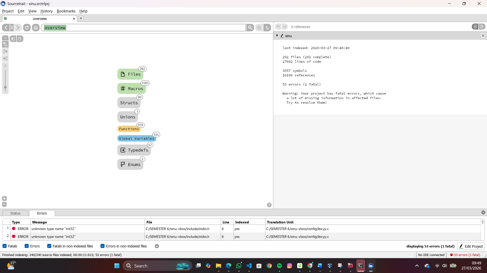

<h1 align="center">Laporan Praktikum Modul X   Sistem Operasi Xinu</h1>

Ardhian Dwi Saputra - 2311104040

---

## Dasar Teori

Xinu (Xinu Is Not Unix) adalah sistem operasi kecil yang digunakan untuk tujuan pembelajaran, terutama untuk memahami konsep dasar sistem operasi seperti manajemen proses, manajemen memori, sistem file sederhana, dan jaringan komputer. Xinu dirancang agar sederhana namun tetap memiliki fitur utama dari sebuah sistem operasi sehingga cocok digunakan sebagai media praktikum.

Xinu menyediakan sebuah shell yang berfungsi sebagai antarmuka antara pengguna dengan sistem operasi. Melalui shell ini, pengguna dapat menjalankan berbagai perintah untuk melihat informasi sistem, mengatur proses, melihat penggunaan memori, serta melakukan konfigurasi jaringan. Dengan adanya shell, pengguna dapat berinteraksi langsung dengan kernel menggunakan perintah-perintah tertentu.

Perintah-perintah pada Xinu digunakan untuk berbagai fungsi seperti menampilkan daftar proses yang sedang berjalan, melihat IP address, melakukan ping ke server lain, membersihkan layar terminal, dan menampilkan statistik memori. Dengan mempelajari dan menjalankan perintah-perintah tersebut, praktikan dapat memahami bagaimana sistem operasi bekerja dalam mengelola sumber daya komputer.

---

## Guided

### 1. Kompilasi Xinu
- Masuk ke folder compile:
- Jalankan perintah:
- File hasil kompilasi:
- Nama: `xinu.elf`
- Ukuran: ±500KB - 1MB
- Lokasi: folder `compile`

📸 Screenshot:

---

### 2. Eksplorasi Source Code dengan Sourcetrail
- Install dan buka Sourcetrail
- Buat project baru
- Tambahkan semua folder Xinu
- Set include path ke:
- Lakukan indexing dan eksplorasi

📸 Screenshot:

---

### 3. Struktur Data Proses
- File: `include/process.h`
- Struktur utama: `struct procent`

Isi informasi:
- `prstate` → status proses  
- `prprio` → prioritas  
- `prstkptr` → pointer stack  
- `prstkbase` → alamat awal stack  

📸 Screenshot:

---

### 4. Modifikasi Welcome Banner
- File banner: `include/*.h`
- File output: `shell/*.c`
- Edit sesuai nama dan NIM

Contoh hasil:

- Recompile:

📸 Screenshot:

---

## Referensi

1. https://en.wikipedia.org/wiki/Data_structure (diakses 26 Maret 2026)
2. Modul Praktikum Sistem Operasi Modul 4