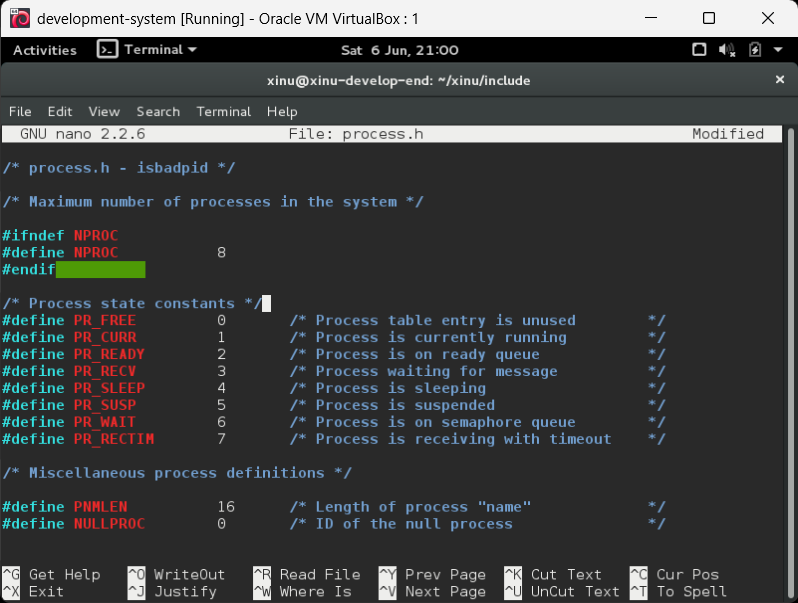
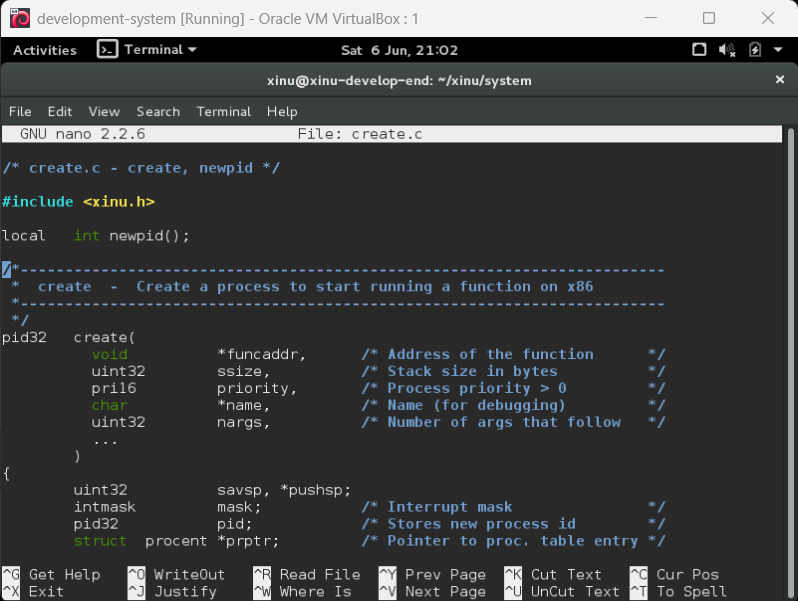
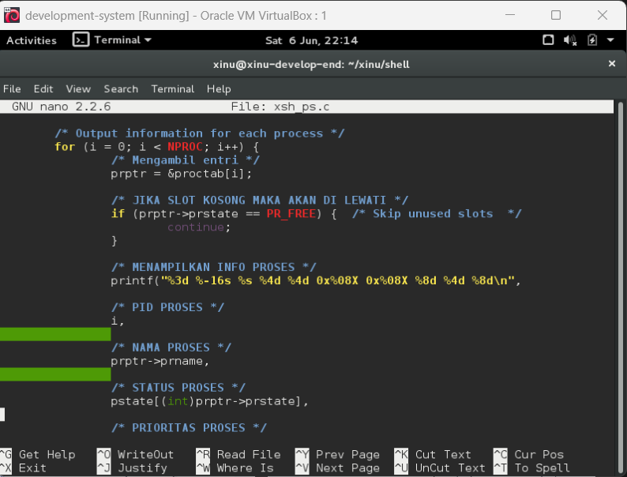
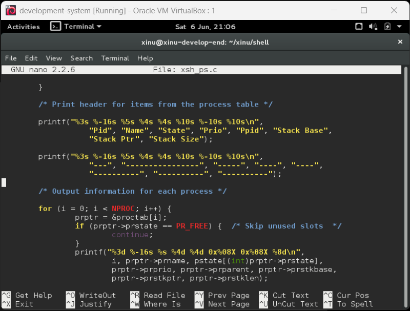
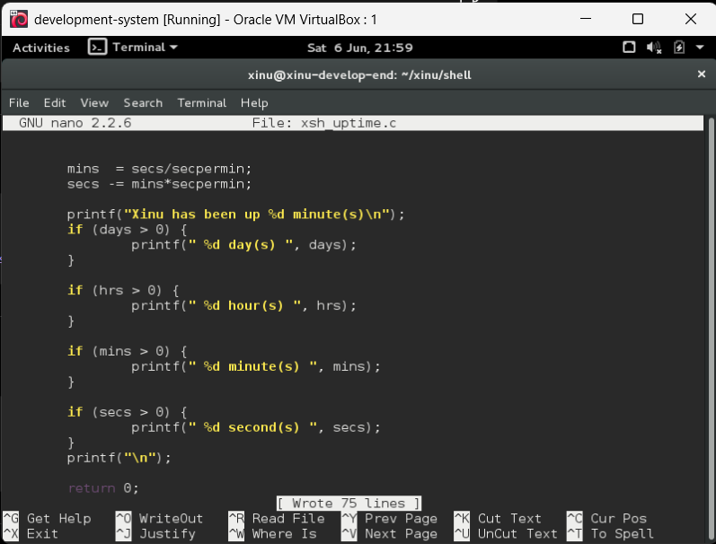

<h1 align="center">Laporan Praktikum Modul 5 <br> Eksplorasi Proses Xinu</h1>
<p align="center">Ardhian Dwi Saputra - 2311104040</p>

---

## Dasar Teori

Process Control Block (PCB) merupakan struktur data yang digunakan sistem operasi untuk menyimpan informasi setiap proses yang sedang berjalan. Pada sistem operasi Xinu, PCB direpresentasikan menggunakan struktur `procent` yang terdapat pada process table.

PCB menyimpan berbagai informasi penting seperti Process ID (PID), state proses, prioritas, stack pointer, nama proses, dan data lain yang diperlukan kernel dalam melakukan manajemen proses. Dengan adanya PCB, sistem operasi dapat melakukan penjadwalan, sinkronisasi, dan pengelolaan sumber daya secara efisien.

Xinu menyediakan beberapa state proses yang menunjukkan kondisi suatu proses selama siklus hidupnya. Informasi tersebut dapat diamati melalui process table dan ditampilkan menggunakan perintah shell seperti `ps`.

Pada praktikum ini dilakukan eksplorasi struktur PCB pada Xinu, analisis source code perintah `ps`, modifikasi perintah `ps` untuk menampilkan informasi message proses, serta modifikasi perintah `uptime` agar hanya menampilkan waktu dalam satuan menit.

---

## Guided

### 1. Eksplorasi Process Control Block (PCB)

Melakukan pengamatan terhadap file:

```c
include/process.h
```

Hasil pengamatan:

| Parameter | Nilai |
|------------|--------|
| Maksimum proses (NPROC) | 8 |
| Maksimum panjang nama proses (PNMLEN) | 16 karakter |
| Total state proses | 8 state |

Daftar state proses:

- PR_FREE
- PR_CURR
- PR_READY
- PR_RECV
- PR_SLEEP
- PR_SUSP
- PR_WAIT
- PR_RECTIM

📸 Screenshot:



---

### 2. Analisis Struktur create.c

Melakukan pengamatan terhadap file:

```c
system/create.c
```

File ini digunakan untuk membuat proses baru pada Xinu dan menentukan parameter penting seperti prioritas, ukuran stack, serta nama proses.

📸 Screenshot:



---

### 3. Analisis Source Code Perintah ps

Perintah `ps` digunakan untuk menampilkan daftar proses yang sedang berjalan pada sistem.

Source code berada pada file:

```c
shell/xsh_ps.c
```

Pada praktikum ini dilakukan pemberian komentar pada 20 baris terakhir source code untuk memahami fungsi masing-masing instruksi yang digunakan.

📸 Screenshot:



---

### 4. Modifikasi Perintah ps

Perintah `ps` dimodifikasi agar menampilkan informasi tambahan berupa:

- Kolom Msg
- Kolom Content

Kolom Msg digunakan untuk menampilkan jumlah pesan yang terdapat pada suatu proses.

Kolom Content digunakan untuk menampilkan isi pesan yang diterima proses.

Setelah proses modifikasi selesai, dilakukan kompilasi ulang sistem dan pengujian menggunakan Backend VM.

📸 Screenshot:



---

### 5. Modifikasi Perintah uptime

File yang dimodifikasi:

```c
shell/xsh_uptime.c
```

Perintah `uptime` diubah agar hanya menampilkan lama waktu sistem berjalan dalam satuan menit sehingga output menjadi lebih sederhana dan mudah dibaca.

📸 Screenshot:



---

## Jawaban Jurnal

### a. Berapa banyaknya maksimum proses yang ada pada Xinu?

Berdasarkan file `process.h`:

```c
#define NPROC 8
```

Jawaban: **8 proses**

---

### b. Berapa maksimal panjang nama suatu proses pada Xinu?

Berdasarkan file `process.h`:

```c
#define PNMLEN 16
```

Jawaban: **16 karakter**

---

### c. Berapa nilai prioritas awal pada saat proses dibuat?

Berdasarkan konfigurasi default shell Xinu:

```c
SHELLPRIO = 20
```

Jawaban: **20**

---

### d. Ada berapa total state pada Xinu? Sebutkan!

Total state pada Xinu adalah **8 state**, yaitu:

- PR_FREE
- PR_CURR
- PR_READY
- PR_RECV
- PR_SLEEP
- PR_SUSP
- PR_WAIT
- PR_RECTIM

---

## Analisis

Berdasarkan hasil praktikum, diketahui bahwa seluruh informasi proses pada Xinu disimpan dalam Process Control Block (PCB). Struktur ini memungkinkan kernel untuk melakukan pengelolaan proses secara efisien melalui informasi state, prioritas, stack, dan identitas proses.

Modifikasi pada perintah `ps` menunjukkan bahwa informasi tambahan mengenai message proses dapat ditampilkan dengan mengakses data yang terdapat pada process table. Penambahan kolom Msg dan Content memudahkan pengguna dalam memonitor komunikasi antar proses.

Selain itu, modifikasi pada perintah `uptime` menunjukkan bahwa output shell pada Xinu dapat disesuaikan sesuai kebutuhan pengguna dengan melakukan perubahan pada source code dan melakukan kompilasi ulang sistem.

Melalui praktikum ini, praktikan memperoleh pemahaman mengenai struktur proses pada sistem operasi Xinu serta mekanisme modifikasi perintah shell yang tersedia.

---

## Kesimpulan

Berdasarkan praktikum yang telah dilakukan dapat disimpulkan bahwa:

1. Xinu menggunakan Process Control Block (PCB) untuk menyimpan informasi setiap proses.
2. Jumlah maksimum proses pada Xinu adalah 8 proses.
3. Panjang maksimum nama proses pada Xinu adalah 16 karakter.
4. Xinu memiliki 8 state proses yang digunakan dalam manajemen proses.
5. Perintah `ps` dapat dimodifikasi untuk menampilkan informasi tambahan mengenai message proses.
6. Perintah `uptime` dapat dimodifikasi untuk menampilkan waktu sistem berjalan dalam satuan menit.
7. Source code shell Xinu dapat dimodifikasi sesuai kebutuhan dengan melakukan kompilasi ulang sistem.

---

## Referensi

1. Modul Praktikum Sistem Operasi Modul 5 – Eksplorasi Proses Xinu.
2. Douglas Comer, Operating System Design: The Xinu Approach.
3. https://xinu.cs.mu.edu