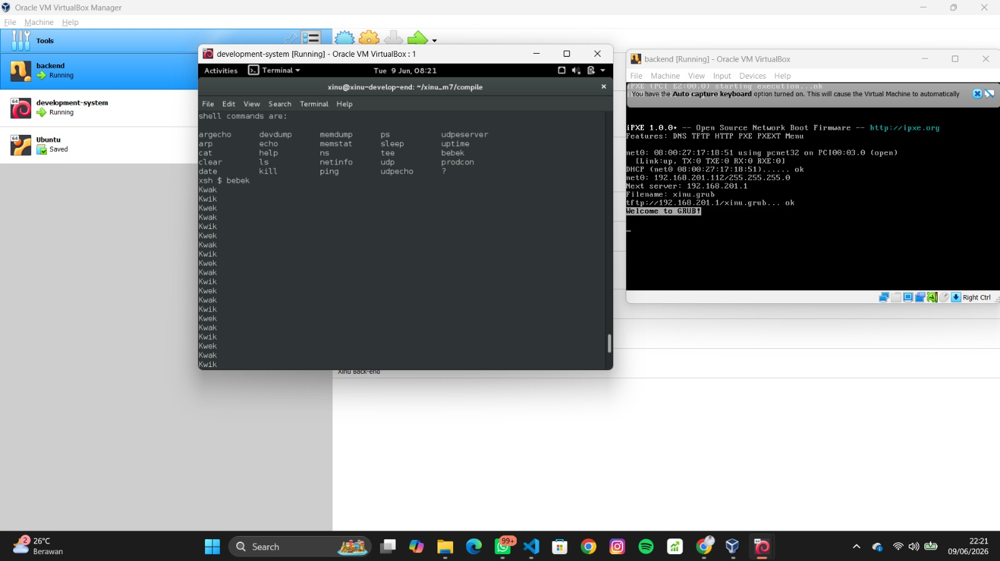
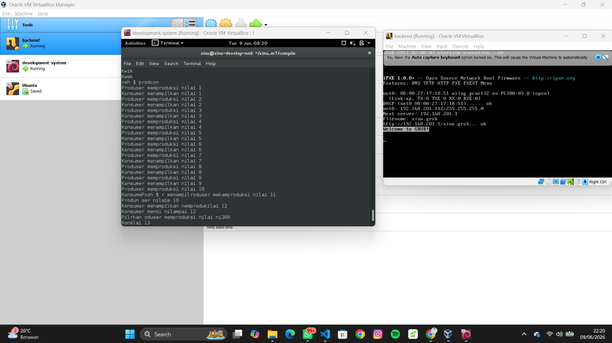

<div align="center">


# Jurnal Modul 7 - Semaphore

### Ardhian Dwi Saputra

### 2311104040

Praktikum Sistem Operasi - Implementasi Semaphore pada Xinu

</div>

---

# 📖 Deskripsi

Praktikum ini bertujuan untuk memahami dan mengimplementasikan mekanisme **Semaphore** pada sistem operasi **Xinu**. Semaphore digunakan untuk melakukan sinkronisasi antar proses sehingga proses dapat berjalan sesuai urutan yang diinginkan dan menghindari terjadinya race condition.

---

# 🎯 Tujuan

* Memahami konsep semaphore.
* Mengimplementasikan sinkronisasi proses menggunakan semaphore.
* Mengimplementasikan permasalahan Producer-Consumer.
* Menggunakan semaphore pada sistem operasi Xinu.

---

# 🦆 Soal 1 - Sinkronisasi Tiga Proses

## Deskripsi

Membuat tiga proses:

* P1 menampilkan **"Kwak"**
* P2 menampilkan **"Kwik"**
* P3 menampilkan **"Kwek"**

dengan urutan output:

```text
Kwak
Kwik
Kwek
Kwak
Kwik
Kwek
...
```

## Command

```bash
bebek
```

## Hasil

Program berhasil menampilkan output secara berurutan menggunakan mekanisme semaphore.

---

# 🏭 Soal 2 - Producer Consumer

## Deskripsi

Membuat dua proses:

* Producer menghasilkan bilangan 1 sampai 1000.
* Consumer menampilkan bilangan yang diproduksi oleh Producer.

Contoh output:

```text
Produser memproduksi nilai 1
Konsumer menampilkan nilai 1

Produser memproduksi nilai 2
Konsumer menampilkan nilai 2
```

## Command

```bash
prodcon
```

## Hasil

Program berhasil melakukan sinkronisasi antara Producer dan Consumer menggunakan semaphore sehingga data yang diproduksi dapat langsung dikonsumsi sesuai urutan.

---

# ⚙️ Langkah Kompilasi

Masuk ke direktori compile:

```bash
cd ~/xinu_m7/compile
```

Compile program:

```bash
make clean
make
```

Menjalankan Minicom:

```bash
sudo minicom --color=on
```

Nyalakan Virtual Machine **backend** untuk menjalankan Xinu.

---

# 📷 Hasil Program

## Soal 1 - Sinkronisasi Tiga Proses

Output command:

```bash
bebek
```



---

## Soal 2 - Producer Consumer

Output command:

```bash
prodcon
```



---


# ✅ Kesimpulan

Pada praktikum ini berhasil diimplementasikan semaphore pada sistem operasi Xinu untuk melakukan sinkronisasi proses. Semaphore mampu mengatur urutan eksekusi proses sehingga program berjalan sesuai dengan yang diharapkan. Implementasi dilakukan pada kasus sinkronisasi tiga proses (Kwak-Kwik-Kwek) dan permasalahan Producer-Consumer.
