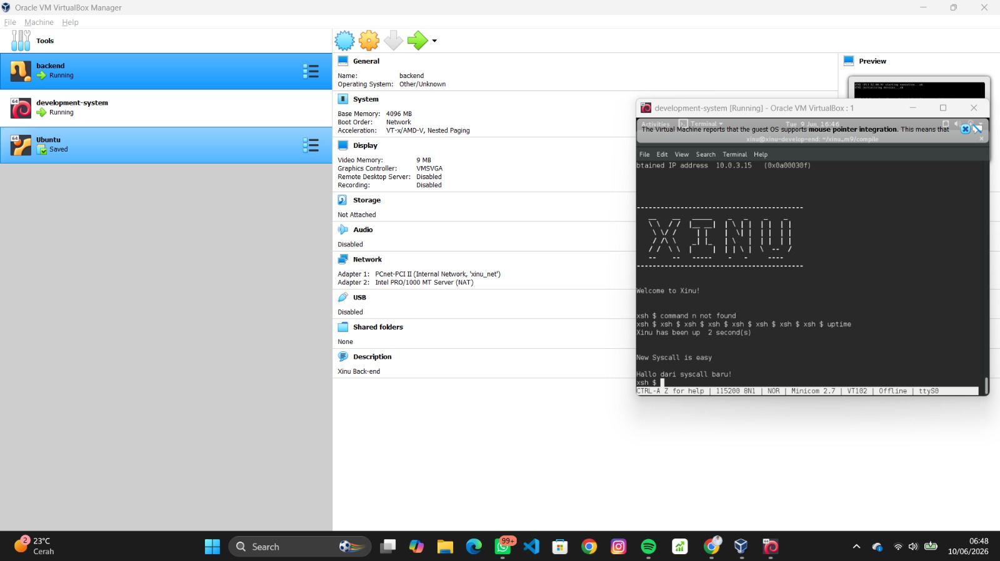
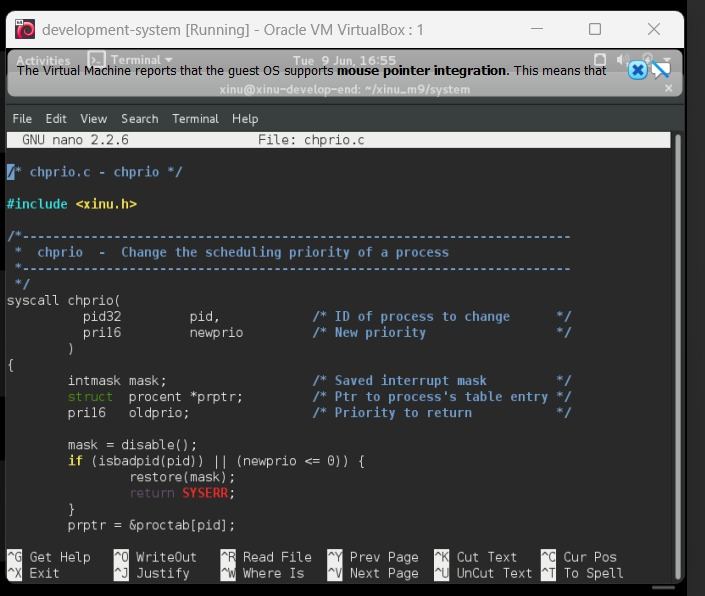
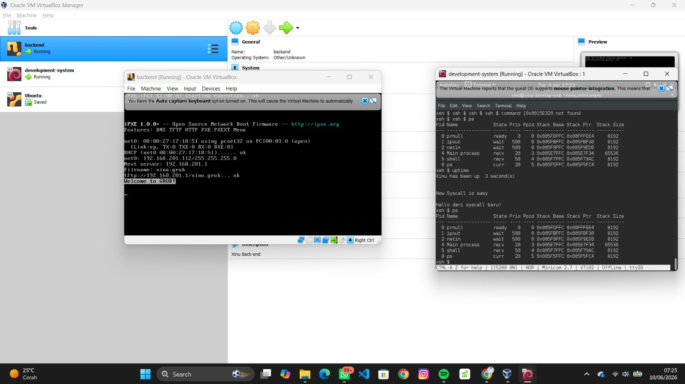

<div align="center">

# Jurnal Modul 9 - Syscall
### Ardhian Dwi Saputra

### 2311104040

Praktikum Sistem Operasi - Implementasi dan Modifikasi Syscall pada Xinu

</div>

---

# 📖 Deskripsi

Praktikum ini bertujuan untuk memahami implementasi **System Call (Syscall)** pada sistem operasi **Xinu**. Pada praktikum ini dilakukan pembuatan syscall baru, modifikasi syscall yang sudah ada, serta pengujian perubahan prioritas proses menggunakan syscall `chprio()`.

---

# 🎯 Tujuan

* Memahami konsep System Call pada Xinu.
* Membuat syscall baru pada sistem operasi Xinu.
* Melakukan modifikasi syscall `chprio()`.
* Melakukan validasi parameter pada syscall.
* Menguji perubahan prioritas proses menggunakan syscall.

---

# 🖥️ Soal 1 - Membuat Syscall Baru

## Deskripsi

Membuat syscall baru bernama:

```c
hallo()
```

yang akan menampilkan pesan:

```text
Hallo dari syscall baru!
```

Syscall dibuat pada file:

```text
system/hallo.c
```

dan dideklarasikan pada:

```text
include/prototypes.h
```

## Hasil

Syscall berhasil dibuat dan dapat dipanggil melalui command `uptime`.

---

# 🔧 Soal 2 - Modifikasi Syscall chprio()

## Deskripsi

Melakukan perbaikan pada syscall:

```text
system/chprio.c
```

dengan menambahkan validasi:

* PID harus valid.
* Prioritas harus bernilai positif (> 0).

Perubahan kode:

```c
if (isbadpid(pid) || (newprio <= 0)) {
    restore(mask);
    return SYSERR;
}
```

## Hasil

Syscall berhasil menolak parameter yang tidak valid dan mengembalikan nilai `SYSERR`.

---

# 🚀 Soal 3 - Pengujian Perubahan Prioritas

## Deskripsi

Menambahkan pemanggilan:

```c
hallo();

chprio(5,33);
```

pada file:

```text
shell/xsh_uptime.c
```

Kemudian dilakukan pengujian menggunakan perintah:

```bash
ps
uptime
ps
```

## Hasil

Prioritas proses berhasil berubah menjadi nilai yang ditentukan setelah syscall dijalankan.

---

# ⚙️ Langkah Kompilasi

Masuk ke direktori compile:

```bash
cd ~/xinu_m9/compile
```

Compile program:

```bash
make clean
make
```

Menjalankan Minicom:

```bash
sudo minicom --color=on
```

Nyalakan Virtual Machine **backend** untuk menjalankan Xinu.

---

# 📷 Hasil Program

## Soal 1 - Implementasi Syscall Baru

Output command:

```bash
uptime
```



---

## Soal 2 - Validasi Syscall chprio()

Source code hasil modifikasi:



---

## Soal 3 - Pengujian Prioritas Proses

Output command:

```bash
ps
uptime
ps
```


---

## Pengujian Prioritas Negatif

Perubahan:

```c
chprio(5,-3);
```

Hasil:

Prioritas proses tidak berubah karena parameter prioritas tidak valid.


---

## Pengujian PID Tidak Valid

Perubahan:

```c
chprio(3000,33);
```

Hasil:

Prioritas proses tidak berubah karena PID tidak valid.



---

# ✅ Kesimpulan

Pada praktikum ini berhasil dibuat syscall baru bernama `hallo()` pada sistem operasi Xinu. Selain itu dilakukan modifikasi syscall `chprio()` dengan menambahkan validasi PID dan prioritas proses. Hasil pengujian menunjukkan bahwa syscall berjalan dengan baik, mampu mengubah prioritas proses yang valid, serta menolak parameter yang tidak sesuai melalui mekanisme validasi yang telah ditambahkan.
