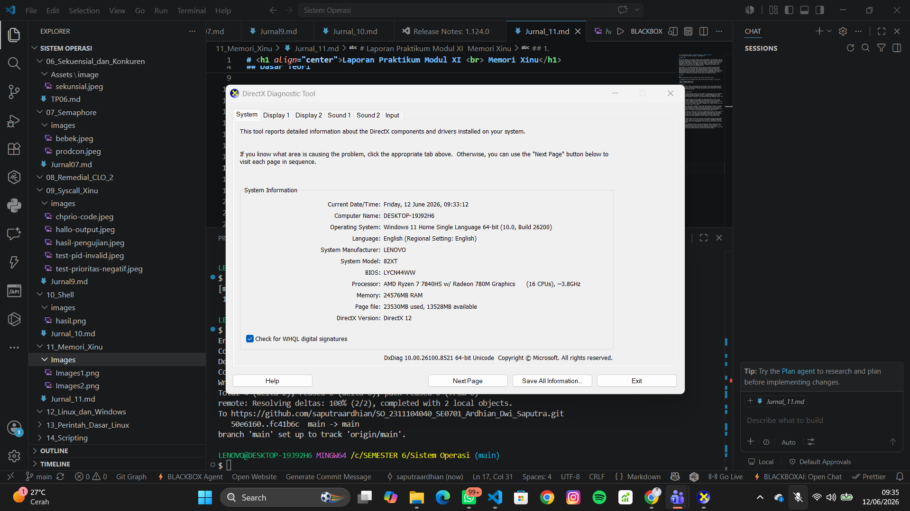
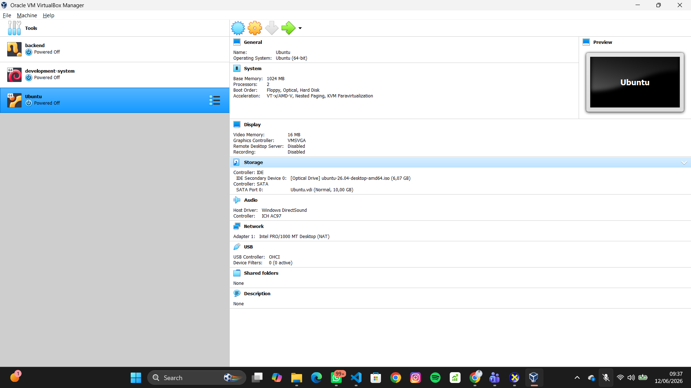
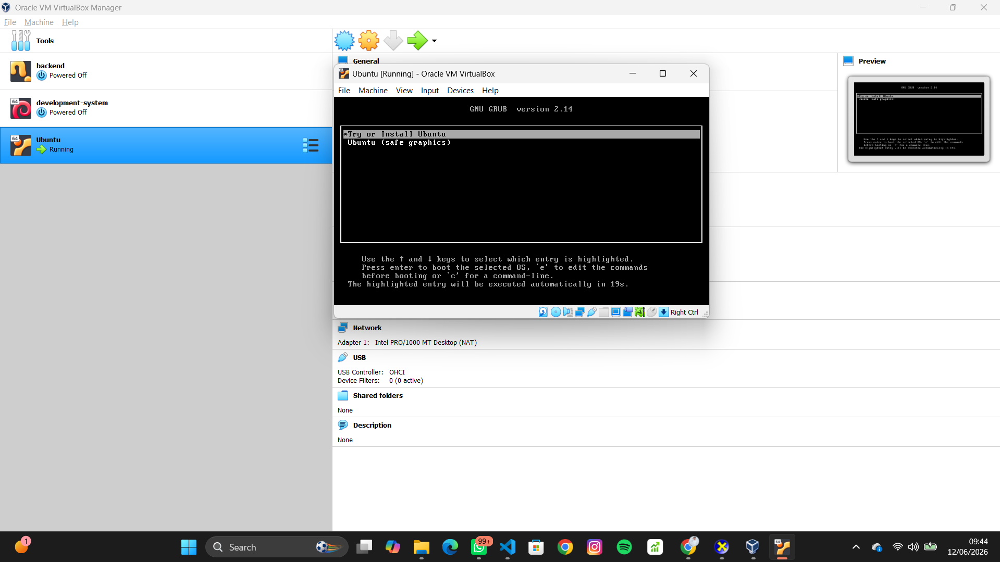

# <h1 align="center">Laporan Praktikum Modul 12  Linux dan Windows </h1>

Ardhian Dwi Saputra - 2311104040

## Dasar Teori

Sistem operasi merupakan perangkat lunak yang berfungsi untuk mengatur dan mengelola seluruh sumber daya yang terdapat pada komputer sehingga perangkat keras dan perangkat lunak dapat bekerja secara optimal. Sistem operasi bertindak sebagai penghubung antara pengguna dengan perangkat keras komputer. Beberapa sistem operasi yang umum digunakan adalah Windows, Linux, dan Xinu. Windows merupakan sistem operasi yang dikembangkan oleh Microsoft dan banyak digunakan karena memiliki antarmuka yang mudah dipahami. Linux merupakan sistem operasi open source yang terkenal karena stabilitas, keamanan, dan fleksibilitasnya. Sedangkan Xinu merupakan sistem operasi yang sering digunakan sebagai media pembelajaran konsep dasar sistem operasi seperti manajemen proses, memori, dan syscall.

## Jurnal

## 1.

Jelaskan dengan bahasa sendiri, apa itu Sistem Operasi?

### Jawaban:

Sistem operasi adalah perangkat lunak utama yang berfungsi mengatur seluruh aktivitas komputer serta menjadi penghubung antara pengguna dengan perangkat keras. Sistem operasi bertugas mengelola memori, menjalankan aplikasi, mengatur file, serta mengendalikan perangkat input dan output agar komputer dapat digunakan dengan baik.

Contoh sistem operasi yang sering digunakan antara lain:

* Windows
* Linux
* macOS
* Android
* iOS

## 2.

Buka dxdiag pada kolom search windows, dan jawab pertanyaan berikut!

### a. Windows apakah yang diinstal?

Windows yang diinstal adalah **Windows 11 Home Single Language**.

### b. Berapa bit Windows yang diinstall?

Windows yang digunakan adalah **64-bit (x64-based PC)**.

### c. Berapa kecepatan processor yang digunakan?

Processor yang digunakan memiliki kecepatan sekitar **2516 MHz**.

### d. Grafik yang digunakan versi berapa? Apakah sudah sesuai dengan spesifikasi rekomendasi pada modul?

Grafik yang digunakan telah mendukung **DirectX 12** sehingga sudah sesuai dengan kebutuhan dan spesifikasi yang direkomendasikan pada modul praktikum.

## 3.

Apa kelebihan dari windows yang terpasang sekarang? Sebutkan versi berapa windows terbaru saat ini!

### Kelebihan Windows 11

* Memiliki tampilan antarmuka yang modern dan lebih menarik.
* Performa lebih baik dibandingkan versi sebelumnya.
* Mendukung fitur keamanan yang lebih lengkap.
* Kompatibel dengan berbagai aplikasi dan perangkat keras.
* Mendukung multitasking dengan fitur Snap Layout.

### Versi Windows Terbaru Saat Ini

Versi Windows terbaru saat ini adalah **Windows 11**.

## 4.

Buka virtualbox, dan jawab pertanyaan berikut!

### a. Linux apakah yang diinstall?

Linux yang diinstal adalah **Ubuntu 26.04 Desktop**.

### b. Berapa bit Linux yang diinstall?

Linux yang digunakan adalah **64-bit**.

### c. Berapa ukuran hard disk virtual mesin?

Ukuran hard disk virtual mesin adalah **10 GB**.

### d. Terdapat berapa buah partisi pada hard disk?

Terdapat **2 partisi**.

## 5.

Linux memiliki berbagai jenis, sebutkan 5 jenis linux distro!

### Jawaban:

Berikut adalah 5 jenis distro Linux yang sering digunakan:

* Ubuntu
* Debian
* Fedora
* Kali Linux
* Linux Mint

## 6.

Anda sudah mengenal dan menggunakan 3 jenis sistem operasi pada praktikum ini, sebutkan sistem operasi tersebut!

### Jawaban:

Terdapat 3 jenis sistem operasi yang digunakan, yaitu:

* Windows
* Linux
* Xinu

## 7.

Setelah mengenal 3 jenis sistem operasi tersebut, menurut Anda sistem operasi mana yang lebih mudah digunakan? Jelaskan argumentasi Anda!

### Jawaban:

Menurut saya, sistem operasi yang paling mudah digunakan adalah Windows. Hal ini karena Windows memiliki antarmuka yang sederhana dan mudah dipahami oleh pengguna. Selain itu, Windows juga mendukung berbagai aplikasi dan driver sehingga cocok digunakan untuk kebutuhan perkuliahan, pekerjaan, maupun penggunaan sehari-hari. Banyaknya dokumentasi dan tutorial yang tersedia juga membuat pengguna lebih mudah dalam mengatasi berbagai permasalahan yang muncul.
