# Laporan Praktikum Modul XV   Keamanan Linux

<b>Ahmad Uffi Lestari M - 2311104015</b>

---

## Dasar Teori

Keamanan merupakan salah satu aspek krusial dalam sistem operasi guna melindungi data dan sumber daya dari akses yang tidak sah serta menjaga keaslian informasi. Dalam praktiknya, keamanan informasi bersandar pada beberapa pilar utama, di antaranya adalah **integritas (_integrity_)** dan **konfidensialitas (_confidentiality_)**.

### 1. Integritas Data & Fungsi Hash

Integritas menjamin bahwa data tidak diubah, dimodifikasi, atau dirusak oleh pihak yang tidak berwenang selama penyimpanan atau transmisi. Untuk memverifikasi integritas ini, digunakan fungsi hash kriptografi seperti `MD5`, `SHA-256`, dan `SHA-512`, yang bertindak sebagai "sidik jari digital" unik dari suatu berkas. Berapa pun ukuran berkasnya, fungsi hash akan menghasilkan nilai keluaran (_hash value_) dengan panjang tetap. Jika suatu file disalin tanpa ada perubahan isi sedikit pun—meskipun nama file tersebut diubah—nilai hash yang dihasilkan akan tetap sama karena algoritma hash murni memproses biner dari konten file tersebut, bukan meta-datanya.

Dalam kriptografi, fungsi hash yang ideal harus memiliki karakteristik yang disebut sebagai **efek longsoran (_avalanche effect_)**. Fenomena ini menyatakan bahwa perubahan sekecil apa pun pada data masukan, bahkan hanya satu bit atau satu tanda titik, akan menghasilkan perubahan yang sangat signifikan dan radikal pada nilai hash keluarannya. Sifat ini sangat penting untuk mendeteksi manipulasi data sekecil apa pun.

Di sisi lain, struktur berkas dari aplikasi modern seperti dokumen teks (`.doc`/`.docx`) sering kali menyimpan metadata internal di dalamnya, seperti informasi waktu modifikasi, riwayat revisi, atau identitas aplikasi pengolahnya. Akibatnya, aktivitas sederhana seperti mengetik teks lalu menghapusnya kembali hingga isinya terlihat sama persis secara visual, tetap akan mengubah struktur metadata di dalam berkas tersebut. Perubahan metadata ini menyebabkan nilai hash akhir berkas berubah, membuktikan bahwa integritas berkas secara struktural telah beralih meskipun konten teks utamanya tampak tidak berubah.

### 2. Konfidensialitas & Enkripsi Berkas (EncFS)

Selain menjaga integritas, sistem operasi juga harus menjamin konfidensialitas, yaitu memastikan bahwa data sensitif hanya dapat diakses oleh pihak yang berhak. Salah satu metode penjaminan konfidensialitas pada level sistem berkas lokal adalah dengan memanfaatkan **EncFS (_Encrypted File System_)**.

EncFS bekerja secara transparan di ruang pengguna (_user-space_) dengan mengaitkan dua buah direktori yang saling berhubungan:

- **Folder Normal:** Tempat pengguna bekerja dan melihat berkas dalam bentuk teks biasa.
- **Folder Terenkripsi:** Tempat sistem menyimpan berkas dalam bentuk acak/tersandi.

Ketika folder dilepas (_unmount_), folder normal akan menjadi kosong atau tidak dapat diakses, sementara data aslinya tetap aman tersimpan dalam bentuk tersandi di folder terenkripsi. Mekanisme ini memastikan bahwa pihak yang tidak memiliki kunci enkripsi atau kata sandi tidak akan bisa membaca isi dokumen tersebut.

### 3. Kriptografi Asimetris (GPG)

Untuk komunikasi data yang lebih aman antar-pengguna di jaringan publik, digunakan kriptografi asimetris melalui perkakas **GPG (_GNU Privacy Guard_)**. Kriptografi asimetris menggunakan sepasang kunci yang terhubung secara matematis, yaitu **kunci publik (_public key_)** dan **kunci privat (_private key_)**.

- **Kunci Publik:** Bersifat terbuka dan dapat disebarkan kepada siapa saja untuk digunakan oleh orang lain dalam mengesahkan tanda tangan digital atau mengenkripsi pesan yang ditujukan kepada pemilik kunci.
- **Kunci Privat:** Harus dijaga kerahasiaannya dan hanya disimpan oleh pemiliknya sendiri karena kunci inilah yang berfungsi untuk mendekripsi (membuka) pesan terenkripsi tersebut.

Melalui skema GPG ini, dua pengguna dapat saling bertukar informasi secara aman tanpa khawatir pesan mereka disadap di tengah jalan, karena hanya kunci privat penerima yang sah yang mampu mengembalikan pesan acak tersebut menjadi teks asli.

---

## Jurnal Praktikum

### Soal 1

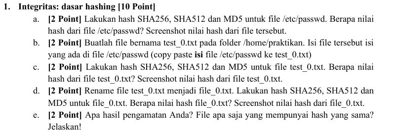

#### Jawaban Soal 1

- **a. Verifikasi nilai hash berkas `/etc/passwd`**
  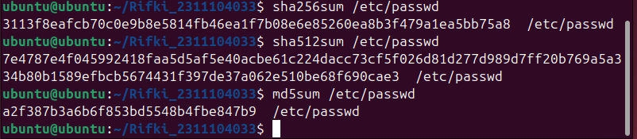
- **b. Duplikasi berkas ke `test_0.txt` dan verifikasi hash**
  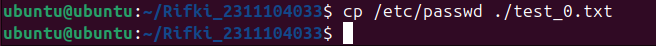
- **c. Mengubah nama berkas menjadi `file_0.txt` dan verifikasi hash**
  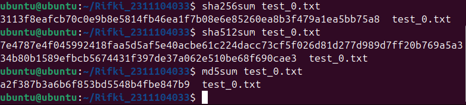
- **d. Perbandingan nilai hash ketiga berkas**
  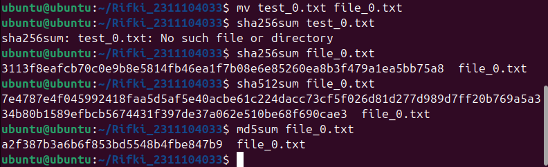

#### e. Hasil Pengamatan & Penjelasan

> **Hasil Analisis:**
> Semua file (`/etc/passwd`, `test_0.txt`, dan `file_0.txt`) menghasilkan nilai hash yang sama persis pada masing-masing algoritma hash (`SHA256`, `SHA512`, dan `MD5`).
>
> Hal ini terjadi karena fungsi hash bekerja dengan cara menghitung data berdasarkan **isi/konten** dari file tersebut, bukan berdasarkan nama filenya. Karena isi ketiga file tersebut identik, perubahan nama file tidak akan mengubah nilai hash-nya sama sekali karena meta-data nama file tidak ikut diproses oleh algoritma hash.

---

### Soal 2

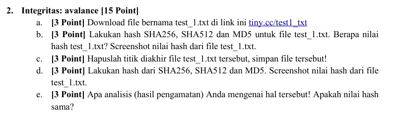

#### Jawaban Soal 2

- **a. Unduh berkas `test_1.txt`**
  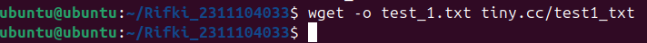
- **b. Verifikasi nilai hash awal `test_1.txt`**
  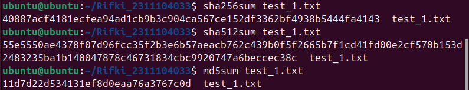
- **c. Modifikasi berkas (menghapus tanda titik di akhir file)**
  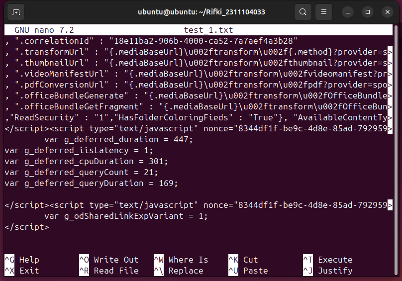
- **d. Verifikasi nilai hash setelah modifikasi**
  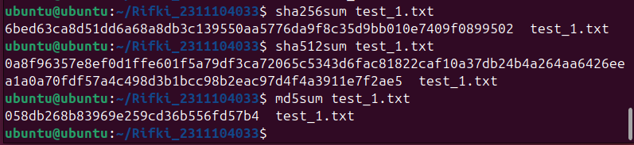

#### e. Hasil Pengamatan & Analisis

> **Hasil Analisis:**
> Nilai hash (`SHA256`, `SHA512`, dan `MD5`) setelah tanda titik dihapus berubah secara total, acak, dan sangat drastis. Nilai hash baru tidak memiliki kemiripan karakter sama sekali dengan nilai hash sebelum file diedit.

---

### Soal 3

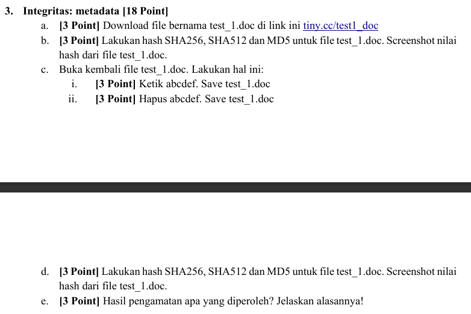

#### Jawaban Soal 3

- **a. Membuat berkas dokumen `test_1.doc` menggunakan LibreOffice Writer**
  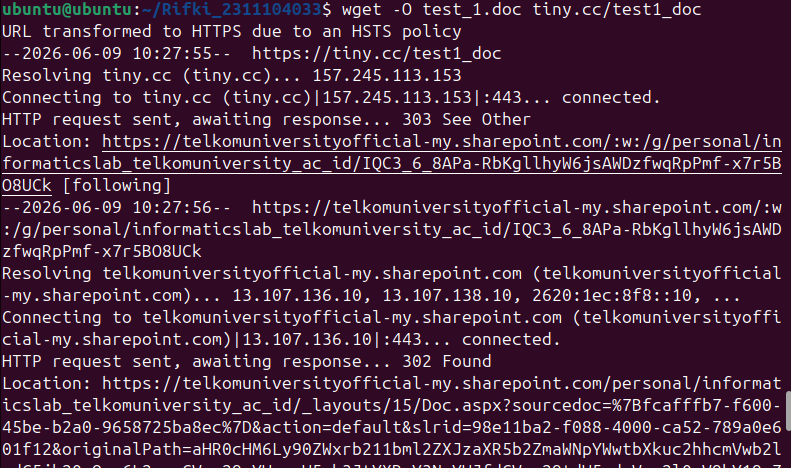
- **b. Verifikasi nilai hash awal `test_1.doc`**
  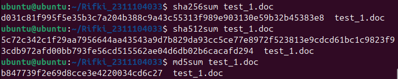
- **c. Modifikasi berkas (mengetik teks tambahan lalu menghapusnya kembali)**
  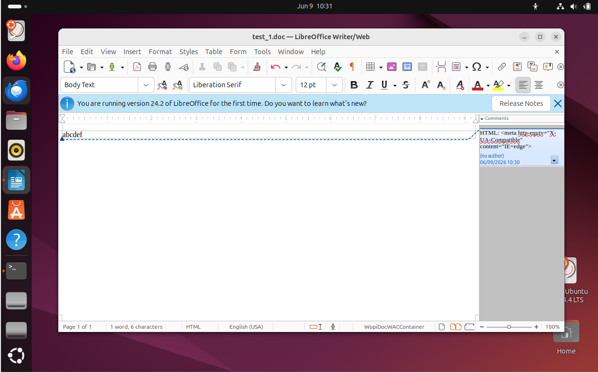
- **d. Verifikasi nilai hash pasca-modifikasi**
  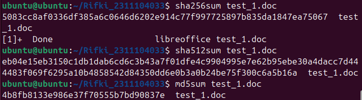

#### e. Hasil Pengamatan & Analisis

> **Hasil Analisis:**
> Nilai hash (`SHA256`, `SHA512`, dan `MD5`) dari file `test_1.doc` setelah dimodifikasi mengalami perubahan, meskipun tampilan dan isi teks di dalam dokumen tersebut sudah dikembalikan ke kondisi semula (kosong/sama persis seperti sebelum diedit).

---

### Soal 4

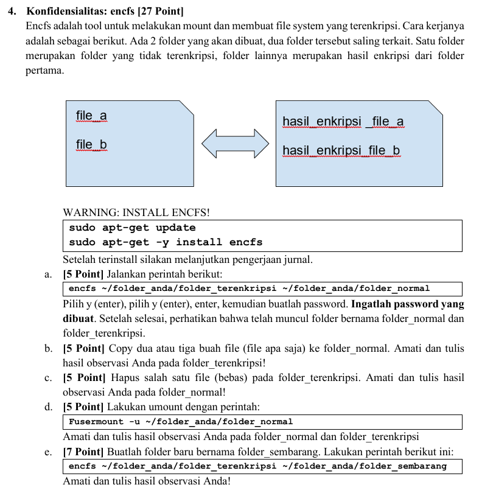

#### Jawaban Soal 4

- **a. Membuat dan mengaitkan `folder_normal` dengan `folder_terenkripsi` menggunakan EncFS**
  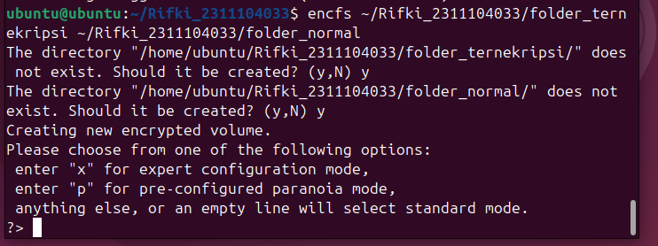
- **b. Pengujian pembuatan file di `folder_normal`**
  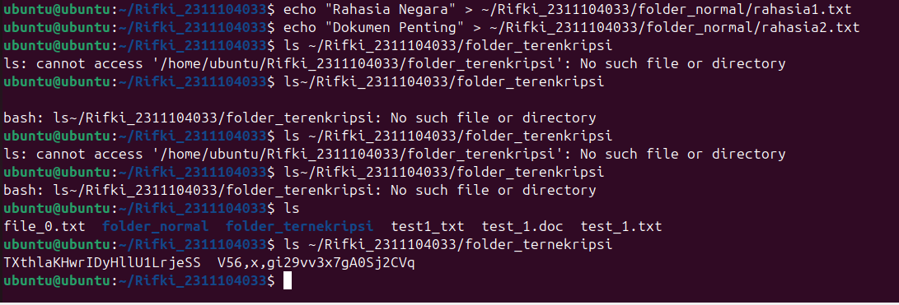

  > **Hasil Observasi:**
  > File yang dimasukkan ke dalam `folder_normal` secara otomatis muncul di dalam `folder_terenkripsi`. Namun, nama file berubah menjadi teks acak yang tidak beraturan dan isinya tidak dapat dibaca karena sudah dienkripsi oleh EncFS.

- **c. Pengujian penghapusan file**
  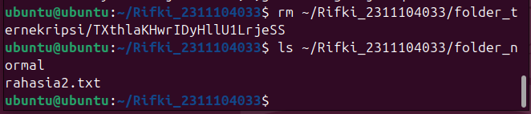

  > **Hasil Observasi:**
  > File asli yang bersesuaian di dalam `folder_normal` ikut terhapus secara otomatis saat file enkripsinya diubah/dihapus. Hal ini membuktikan bahwa kedua folder tersebut tersinkronisasi secara dua arah secara _real-time_.

- **d. Melepas kaitan direktori (_unmount_)**
  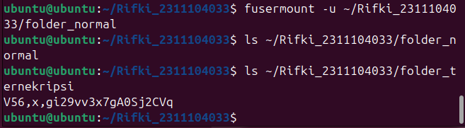

  > **Hasil Observasi:**
  > Setelah di-_unmount_, `folder_normal` menjadi kosong melompong (tidak ada file sama sekali). Sementara itu, file-file di dalam `folder_terenkripsi` tetap ada namun dalam kondisi terenkripsi (nama acak). Ini menunjukkan data aman tersembunyi ketika sistem tidak di-_mount_.

- **e. Mengaitkan kembali folder terenkripsi ke _mount point_ baru (`folder_sembarang`)**
  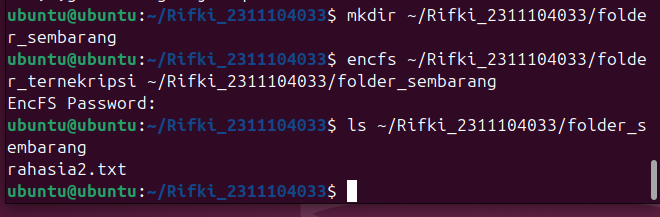
  > **Hasil Observasi:**
  > File asli yang sebelumnya berada di `folder_normal` kini muncul kembali dengan normal (nama asli dan bisa dibaca kembali) di dalam `folder_sembarang`. Ini menunjukkan data terenkripsi di `folder_terenkripsi` bisa dibuka di direktori mana saja (_mount point_ baru) asalkan password enkripsi yang dimasukkan benar.

---

### Soal 5

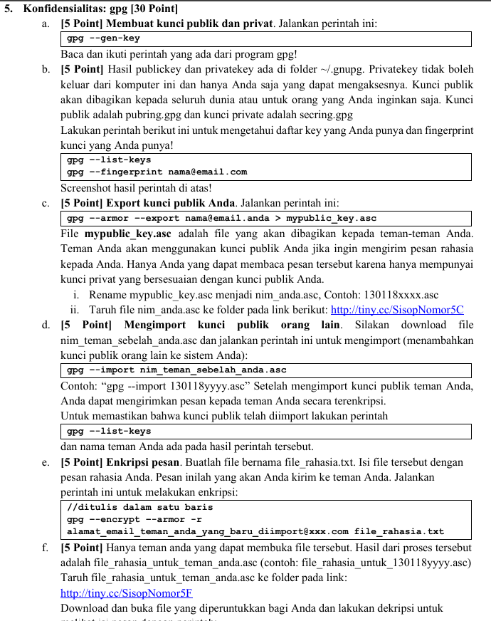

#### Jawaban Soal 5

- **a. Membuat sepasang kunci (_key pair_) baru menggunakan GPG**
  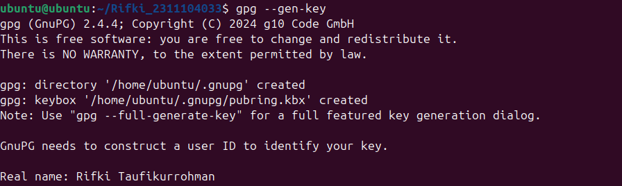
- **b. Ekspor kunci publik (_public key_) menjadi file berkstensi `.asc`**
  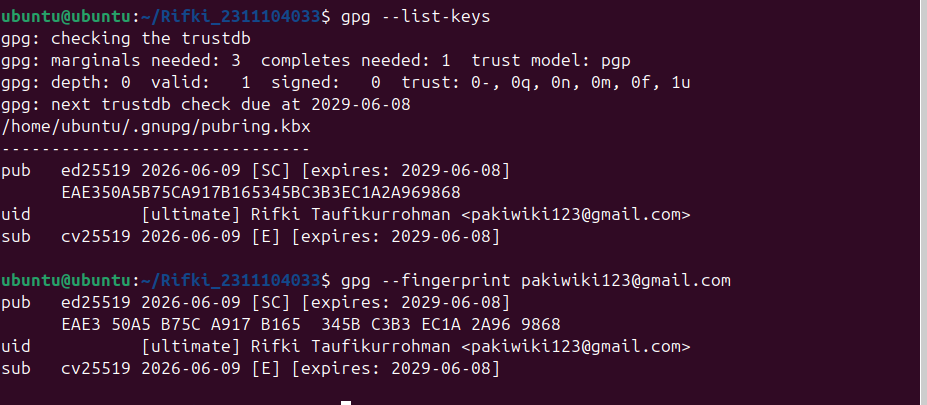
- **c. Impor kunci publik milik rekan kelompok**
  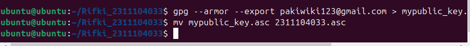
- **d. Membuat file teks pesan dan mengenkripsinya menggunakan kunci publik rekan**
  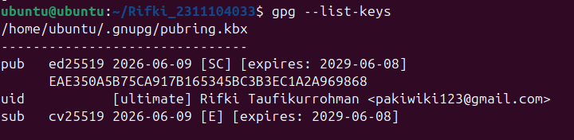
- **e. Melakukan enkripsi berkas**
  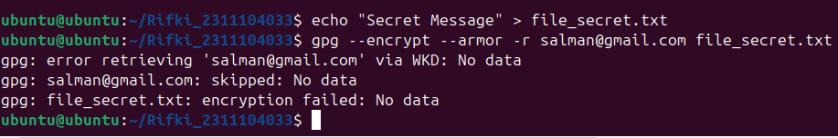
- **f. Mendekripsi berkas kiriman dari rekan menggunakan kunci privat sendiri**
  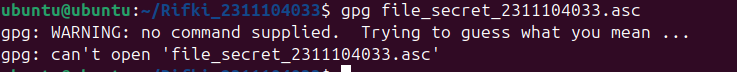
